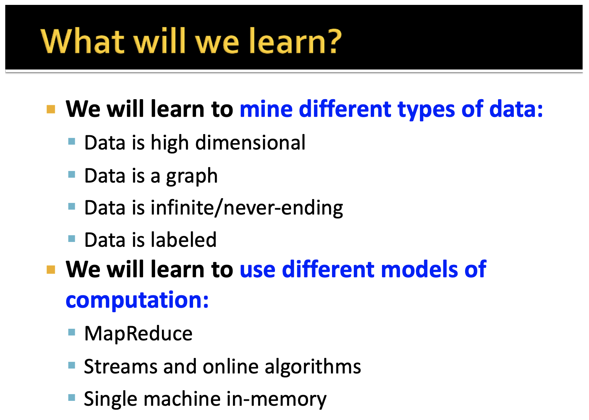

# CS246: Mining Massive Data Sets

course website: http://www.mmds.org/

## Overview

In this course, you will learn many of the interesting algorithms that have been developed for efficient processing of large amounts of data in order to extract simple and useful models of that data.  These techniques are often used to predict properties of future instances of the same sort of data, or simply to make sense of the data already available.  Many people view data mining, or "big data" as machine learning.  There are indeed some techniques for processing large datasets that can be considered machine learning, and we shall cover a number of these.  But there are also many algorithms and ideas for dealing with big data that are not usually classified as machine learning, and we shall cover many of these as well.

1. MapReduce
2. Link Analysis (PageRank)
3. Locality-Sensitive Hashing
4. Distance Measures and Nearest-Neighbor Learning
5. Frequent Itemset Analysis
6. Social-Network Graphs
7. Algorithms for Data Streams
8. Recommendation Systems
9. Dimensionality Reduction
10. Clustering
11. Computational Advertising
12. Machine Learning
13. More on MapReduce Algorithms
14. More on Locality-Sensitive Hashing
15. More on Link Analysis

## Main Concepts by Module

### Module 1: MapReduce

**Materials**

In the first module, consisting of Videos 1-4, we discuss MapReduce.  This programming system, originally implemented at Google by Jeff Dean and Sanjay Ghemawat, is popularly known by the open-source system Hadoop.  More recently, the more modern implementation of the concept, called Spark, has begun to replace Hadoop in many applications.  The value of MapReduce is that it lets you write code that can exploit massively parallel computing without your having to think about the parallelism itself.  It also takes over the responsibility for coping with the possibility of hardware or other failures as a long-running job executes.

This module is a bare introduction to MapReduce.  In Module 13 we shall look at how some common computations are performed using the MapReduce computation model and learn a little about the limitations of what MapReduce can do.

- Distributed File Systems
    - [slides](slides/mooc/01.pdf)
    - [video](https://www.youtube.com/watch?v=jDlrfBLAIuQ)
- The MapReduce Computational Model
    - [slides](slides/mooc/02.pdf)
    - [video](https://www.youtube.com/watch?v=VEh91xTIEIU)
- Scheduling and Data Flow
    - [slides](slides/mooc/03.pdf)
    - [video](https://www.youtube.com/watch?v=4_Eco-v4wlI)
- Combiners and Partition Functions[Advanced]
    - [slides](slides/mooc/04.pdf)
    - [video](https://www.youtube.com/watch?v=jYjZ527n-ZU)

**Readings**

For the first module, you should read Sections 2.1 and 2.2 of the MMDS Book.  We shall not cover the material in Ch. 1 explicitly, but it would be a good idea for you to read that chapter now.

---

### Module 2: PageRank

**Materials**

The  topic of this module  is PageRank.  This is the technique invented by Larry Page for estimating the importance of a Web page.  It is used in Google to help choose the most useful pages to show in response to a search query.

We return to this topic in Module 15,  There, we discuss how the PageRank idea is used in applications other than measuring importance of pages, and also how "link spam" -- attempts to fool Google into thinking a page is important when it is not -- is combatted.

- Link Analysis and PageRank
    - [slides](slides/mooc/05.pdf)
    - [video](https://www.youtube.com/watch?v=bK934gcJMS4)
- PageRank: The Flow Formulation
    - [slides](slides/mooc/06.pdf)
    - [video](https://www.youtube.com/watch?v=Nvb1WVWoYt4)
- PageRank: The Matrix Formulation
    - [slides](slides/mooc/07.pdf)
    - [video](https://www.youtube.com/watch?v=e2SZY3NbtQ8)
- PageRank: Power Iteration
    - [slides](slides/mooc/08.pdf)
    - [video](https://www.youtube.com/watch?v=CWzmnzB04eg)
- PageRank: The Google Formulation
    - [slides](slides/mooc/09.pdf)
    - [video](https://www.youtube.com/watch?v=TSGQ4F1E6H8)
- Why Teleports Solve the Problem
    - [slides](slides/mooc/10.pdf)
    - [video](https://www.youtube.com/watch?v=VoYMFLvDnv0)
- How we Really Compute PageRank
    - [slides](slides/mooc/11.pdf)
    - [video](https://www.youtube.com/watch?v=BUuRL_dIpr0)
    
**Readings**

You should read Sections  5.1 and 5.2 of the MMDS Book.

---

### Module 3: Locality-Sensitive Hashing

**Materials**

This is a surprisingly useful technique for dealing with situations were we need to find related pairs of items, even in relatively small datasets.  For example, if you have a million items, there are half a trillion pairs, and examining each pair for similarity is generally prohibitive.

This module serves as an introduction to the topic.  We shall cover some more advanced topics related to locality-sensitive hashing in Module 14.

- Finding Similar Sets
    - [slides](slides/mooc/12.pdf)
    - [video](https://www.youtube.com/watch?v=c6xK9WgRFhI)
- Minhashing
    - [slides](slides/mooc/13.pdf)
    - [video](https://www.youtube.com/watch?v=96WOGPUgMfw)
- Locality-Sensitive Hashing
    - [slides](slides/mooc/14.pdf)
    - [video](https://www.youtube.com/watch?v=_1D35bN95Go)
- Applications of LSH
    - [slides](slides/mooc/15.pdf)
    - [video](https://www.youtube.com/watch?v=HDiswW6mF0E)
- Fingerprint Matching
    - [slides](slides/mooc/16.pdf)
    - [video](https://www.youtube.com/watch?v=Pl9zaxp8Nj8)
- Finding Duplicate News Articles
    - [slides](slides/mooc/17.pdf)
    - [video](https://www.youtube.com/watch?v=EKPCuAycOdw)

**Readings**

We recommend the following sections of the MMDS Book: Sect. 3.1-3.4 and Sect. 3.8.

---

### Module 4: Distance Measures, Nearest-Neighbor Learning

**Materials**

This module could be called "miscellaneous." It consists of two videos on unrelated topics.

Video 18 covers distance measures.  This material will be useful in a number of settings, including later in the course when we revisit locality-sensitive hashing in a more general setting, and when we discuss clustering.

Video 19 is our first visit to the body of large-scale machine-learning techniques.  It covers near-neighbor learning, where we use the entire training set to classify new data according to its similarity to members of the training set.

- Distance Measures
    - [slides](slides/mooc/18.pdf)
    - [video](https://www.youtube.com/watch?v=pENvMSvqgoA)
- Nearest Neighbor Learning
    - [slides](slides/mooc/19.pdf)
    - [video](https://www.youtube.com/watch?v=7fAd5VUvdXQ)

**Readings**

We recommend the following sections of the MMDS Book: Sect. 3.5 on Distance measures and Sect. 12.4 on near-neighbor learning.

---

### Module 5: Frequent Itemsets

**Materials**

Videos 20-23 discuss how we find frequent itemsets in "market baskets."  The original application was finding things that are frequently bought together in a store, e.g., bread and butter.  While these techniques usually produce results that are not as accurate as the best machine-learning techniques, they offer two advantages.  First, they can be implemented quite efficiently, even on very large datasets.  Second, they not only produce a model, but the model itself is understandable.  That is, it gives you specific rules that justify conclusions, rather than just "the model says so."

- Frequent Itemsets
    - [slides](slides/mooc/20.pdf)
    - [video](https://www.youtube.com/watch?v=6Bl4wYJl3rY)
- A-Priori Algorithm
    - [slides](slides/mooc/21.pdf)
    - [video](https://www.youtube.com/watch?v=n2E4Tzt_Teo)
- Improvements to A-Priori[Advanced]
    - [slides](slides/mooc/22.pdf)
    - [video](https://www.youtube.com/watch?v=AGAkNiQnbjY)
- All or Most Frequent Itemsets in 2 Passes[Advanced]
    - [slides](slides/mooc/23.pdf)
    - [video](https://www.youtube.com/watch?v=b-guME_xZiw)

**Readings**

We recommend the following sections of the MMDS Book: Sect. 6.1-6.4.

---

### Module 6: Communities in Social Networks

**Materials**

The topic of this module is Finding Communities.  There are many very large graphs that represent connections in a social network.  For example, the Facebook "friends" graph has about a billion and a half nodes (people) and half a trillion or  more edges (connections between two people who are Facebook friends).  These graphs have many interesting properties, not the least of which is that nodes tend to form "communities" -- small sets of nodes with an unexpectedly large number of edges among them.  For example, you might be in a community consisting of your family members, and another community consisting of the members of a club to which you belong.  Discovering communities in a very large graph is difficult.  We present a number of algorithms that do a reasonable job in a reasonable amount of time.

- Community Detection in Graphs: Motivation
    - [slides](slides/mooc/24.pdf)
    - [video](https://www.youtube.com/watch?v=MiKecKWbJhM)
- The Affiliation Graph Model
    - [slides](slides/mooc/25.pdf)
    - [video](https://www.youtube.com/watch?v=gqxLMdUazPc)
- From AGM to BIGCLAM
    - [slides](slides/mooc/26.pdf)
    - [video](https://www.youtube.com/watch?v=34I03lF_JOU)
- Solving the BIGCLAM
    - [slides](slides/mooc/27.pdf)
    - [video](https://www.youtube.com/watch?v=qF71tuVRWc0)
- Detecting Communities as Clusters[Advanced]
    - [slides](slides/mooc/28.pdf)
    - [video](https://www.youtube.com/watch?v=FtFzR7CAqIc)
- What Makes a Good Cluster?[Advanced]
    - [slides](slides/mooc/29.pdf)
    - [video](https://www.youtube.com/watch?v=WBV-LrQKHL8)
- The Graph Laplacian Matrix[Advanced]
    - [slides](slides/mooc/30.pdf)
    - [video](https://www.youtube.com/watch?v=0Y70KwTreUM)
- Examples of Eigendecompositions of Graphs[Advanced]
    - [slides](slides/mooc/31.pdf)
    - [video](https://www.youtube.com/watch?v=Kiq58zZ5obk)
- Defining the Graph Laplacian[Advanced]
    - [slides](slides/mooc/32.pdf)
    - [video](https://www.youtube.com/watch?v=AR7iFxM-NkA)
- Spectral Graph Partitioning: Finding a Partition[Advanced]
    - [slides](slides/mooc/33.pdf)
    - [video](https://www.youtube.com/watch?v=KTh9lRaA9nA)
- Spectral Clustering: Three Steps[Advanced]
    - [slides](slides/mooc/34.pdf)
    - [video](https://www.youtube.com/watch?v=TqEyfUttiNc)
- Analysis of Large Graphs: Trawling[Advanced]
    - [slides](slides/mooc/35.pdf)
    - [video](https://www.youtube.com/watch?v=LGces1YIOro)

**Readings**

We recommend the following sections of the MMDS Book: Sect. 10.1-10.5.

---

### Module 7: Stream Algorithms

**Materials**

In the stream model, data arrives at a system very rapidly and at a rate that is not under the control of the system managers.  An example is the stream of search queries to Google or the stream of clicks at Amazon.  Analyzing such data in real time is a serious challenge.  We offer algorithms for extracting answers to some common and important questions about these streams.

- Mining Data Streams
    - [slides](slides/mooc/36.pdf)
    - [video](https://www.youtube.com/watch?v=uH2nVe08UN0)
- Counting 1's[Advanced]
    - [slides](slides/mooc/37.pdf)
    - [video](https://www.youtube.com/watch?v=rHtqC315hdc)
- Bloom Filters
    - [slides](slides/mooc/38.pdf)
    - [video](https://www.youtube.com/watch?v=rWazMA5ORSg)
- Sampling a Stream
    - [slides](slides/mooc/39.pdf)
    - [video](https://www.youtube.com/watch?v=nBMabNdj5B8)
- Counting Distinct Elements[Advanced]
    - [slides](slides/mooc/40.pdf)
    - [video](https://www.youtube.com/watch?v=gbFIAA99GZU)

**Readings**

We recommend the following sections of the MMDS Book:  Sect. 4.1-4.6.

---

### Module 8: Recommendation Systems

**Meterials**

This module covers Recommendation Systems (Videos 41-45).  These are the systems you see when you buy something and are told "people who bought that also bought ..."  For example, we might start with the exact set of videos watched by each of the Netflix subscribers, so a subscriber would be represented by a vector of 0's and 1's -- 1 if they watched the movie and 0 if not.  This data has dimension equal to the number of movies ever made.  But you can often get a good idea of what movies a subscriber would like by grouping movies and subscribers into "genres," e.g., "adventure," "romance," "sci-fi," and so on.  You can get a good idea of what a subscriber would like by looking at the genres of the movies they tend to watch.

- Overview of Recommender Systems
    - [slides](slides/mooc/41.pdf)
    - [video](https://www.youtube.com/watch?v=hOQg2LQM4ec)
- Content-Based Recommendations
    - [slides](slides/mooc/42.pdf)
    - [video](https://www.youtube.com/watch?v=IlqnNWuqToo)
- Collaborative Filtering
    - [slides](slides/mooc/43.pdf)
    - [video](https://www.youtube.com/watch?v=3Sl_nFQbLQA)
- Implementing Collaborative Filtering[Advanced]
    - [slides](slides/mooc/44.pdf)
    - [video](https://www.youtube.com/watch?v=Tsmom3S7zeE)
- Evaluating Recommender Systems
    - [slides](slides/mooc/45.pdf)
    - [video](https://www.youtube.com/watch?v=8l4Xg9AnIjw)

**Readings**

We recommend you look at all of Chapter 9 of the MMDS Book.

---

### Module 9: Dimensionality Reduction

**Meterials**

Dimensionality reduction is an important technique for dealing with large-scale, high-dimensional data.  Often, this data can be viewed (approximately) as having a much lower dimension, provided we can establish the proper directions for these dimensions.  Doing so allows us to represent long vectors of coordinates for a single point by a much shorter vector, thus compacting the data without losing (much) information.

- Dimensionality Reduction: Introduction
    - [slides](slides/mooc/46.pdf)
    - [video](https://www.youtube.com/watch?v=SMvNwg9vraM)
- Singular-Value Decomposition
    - [slides](slides/mooc/47.pdf)
    - [video](https://www.youtube.com/watch?v=dt9iJPNFqaI)
- Dimensionality Reduction with SVD
    - [slides](slides/mooc/48.pdf)
    - [video](https://www.youtube.com/watch?v=NeUccFkWYQw)
- SVD Gives the Best Low-Rank Approximation[Advanced]
    - [slides](slides/mooc/49.pdf)
    - [video](https://www.youtube.com/watch?v=iG517ZbIzMw)
- SVD Example and Conclusion
    - [slides](slides/mooc/50.pdf)
    - [video](https://www.youtube.com/watch?v=uk_sn-cbhc4)
- CUR Decomposition[Advanced]
    - [slides](slides/mooc/51.pdf)
    - [video](https://www.youtube.com/watch?v=TOjyKVYDeNg)
- The CUR Algorithm[Advanced]
    - [slides](slides/mooc/52.pdf)
    - [video](https://www.youtube.com/watch?v=PzSshMESoug)
- Discussion of the CUR Method
    - [slides](slides/mooc/53.pdf)
    - [video](https://www.youtube.com/watch?v=AkaNE-Zep6Q)
- Latent-Factor Models
    - [slides](slides/mooc/54.pdf)
    - [video](https://www.youtube.com/watch?v=voihjWZi0Sk)
- Latent-Factor Recommender System
    - [slides](slides/mooc/55.pdf)
    - [video](https://www.youtube.com/watch?v=EjPddX1nF8Q)
- Finding the Latent Factors
    - [slides](slides/mooc/56.pdf)
    - [video](https://www.youtube.com/watch?v=nBMabNdj5B8)
- Extension to Include Global Effects[Advanced]
    - [slides](slides/mooc/57.pdf)
    - [video](https://www.youtube.com/watch?v=DCR9Ng9JVUk)

**Readings**

You should look at all of Chapter 11 in the MMDS Book.

---

### Module 10: Clustering

**Materials**

The problem of clustering is to take a collection of points and group them into "clusters," such that members of the same cluster are close, while members of different clusters are far.  You should recall or review the material in Module 4 on distance measures, which is important to help understand clustering.

- Overview of Clustering
    - [slides](slides/mooc/58.pdf)
    - [video](https://www.youtube.com/watch?v=YdqTScQFKQs)
- Hierarchical Clustering
    - [slides](slides/mooc/59.pdf)
    - [video](https://www.youtube.com/watch?v=U3sdWVqMWEc)
- The k-Means Algorithm
    - [slides](slides/mooc/60.pdf)
    - [video](https://www.youtube.com/watch?v=mQQA2-yq4L4)
- The BFR Algorithm
    - [slides](slides/mooc/61.pdf)
    - [video](https://www.youtube.com/watch?v=pS38Ofy3Qig)
- The CURE Algorithm[Advanced]
    - [slides](slides/mooc/62.pdf)
    - [video](https://www.youtube.com/watch?v=bIr_GRGNyV4)

**Readings**

We recommend you look at Sect. 7.1-7.5 in the MMDS Book.

---

### Module 11: Computational Advertising

**Materials**

The problem of Computational Advertising is inspired by the way Google and other Internet companies assign advertisements to search queries or page views.  The model is that there are advertisers, who bid for the privilege to have their ad displayed.  There is generally a budget; that is, each advertiser is willing to spend only a fixed amount buying ads each day.  The goal of the advertising system is to allocate opportunities to advertiser, so that each advertiser is able to get exactly as many displays of their ad as they asked for.  This problem leads us to discuss a more general problem -- on-line algorithms, where good decisions need to be made in real time, without knowing what the future will bring.  The on-line-algorithms problem is quite interesting in its own right, and comes up in many different settings.

- Computational Advertising: Bipartite Graph Matching
    - [slides](slides/mooc/63.pdf)
    - [video](https://www.youtube.com/watch?v=iIX3rN2725A)
- The AdWords Problem
    - [slides](slides/mooc/64.pdf)
    - [video](https://www.youtube.com/watch?v=pdV2TGRJILU)
- The Balance Algorithm
    - [slides](slides/mooc/65.pdf)
    - [video](https://www.youtube.com/watch?v=DqZK3u_gmNw)
- Generalized Balance[Advanced]
    - [slides](slides/mooc/66.pdf)
    - [video](https://www.youtube.com/watch?v=9Mj8ISjdhJw)

**Readings**

We recommend you look at all of Ch. 8 of the MMDS Book.

---

### Module 12: Machine Learning

**Materials**

In this module we cover two kinds of large-scale machine learning algorithms:

1. Support-Vector Machines.  This is an important machine-learning technique for separating classes of points linearly.  It is an improvement on the perceptron approach which is covered in the MMDS book but will not be covered in the MOOC.
2. Decision Trees.  This is another machine-learning technique that can classify points that are not naturally separated linearly.

- Support Vector Machines: Introduction
    - [slides](slides/mooc/67.pdf)
    - [video](https://www.youtube.com/watch?v=ldn_PhFK8L8)
- Support Vector Machines: Mathematical Formulation
    - [slides](slides/mooc/68.pdf)
    - [video](https://www.youtube.com/watch?v=jO6UnwiIEG4)
- What is the Margin?
    - [slides](slides/mooc/69.pdf)
    - [video](https://www.youtube.com/watch?v=p_OQOVA_tk4)
- Soft-Margin SVMs
    - [slides](slides/mooc/70.pdf)
    - [video](https://www.youtube.com/watch?v=IXi9GqbguSo)
- How to Compute the Margin[Advanced]
    - [slides](slides/mooc/71.pdf)
    - [video](https://www.youtube.com/watch?v=M5f18H-iSJQ)
- Support Vector Machines: Example
    - [slides](slides/mooc/72.pdf)
    - [video](https://www.youtube.com/watch?v=SGGjrYXqnYg)
- Decision Trees
    - [slides](slides/mooc/73.pdf)
    - [video](https://www.youtube.com/watch?v=C3KXOQ6_7ak)
- How to Construct a Tree
    - [slides](slides/mooc/74.pdf)
    - [video](https://www.youtube.com/watch?v=IG0IKHs33_o)
- Information Gain
    - [slides](slides/mooc/75.pdf)
    - [video](https://www.youtube.com/watch?v=XzcJoshhgG8)
- Building Decision Trees Using MapReduce[Advanced]
    - [slides](slides/mooc/76.pdf)
    - [video](https://www.youtube.com/watch?v=PkyhiOqDMzc)
- Decision Trees: Conclusion
    - [slides](slides/mooc/77.pdf)
    - [video](https://www.youtube.com/watch?v=w31h6luDHtw)

**Readings**

Read Section 12.3 of the MMDS Book.  You may also want to look at Section 12.2 (perceptrons) for background.

---

### Module 13: More About MapReduce

**Materials**

 We return to the study of MapReduce, now discussing some specific algorithms that conform to the constraints imposed by MapReduce systems.  We also introduce the limitations of MapReduce systems and why designing a MapReduce algorithm is not exactly the same thing as just designing a parallel algorithm.

- MapReduce Algorithms Part I[Advanced]
    - [slides](slides/mooc/78.pdf)
    - [video](https://www.youtube.com/watch?v=EDDKdND4oO4)
- MapReduce Algorithms Part II[Advanced]
    - [slides](slides/mooc/79.pdf)
    - [video](https://www.youtube.com/watch?v=k3wCw6aqrhk)
- Theory of MapReduce Algorithms[Advanced]
    - [slides](slides/mooc/80.pdf)
    - [video](https://www.youtube.com/watch?v=TMrZqpVvSmo)
- Matrix Multiplication in MapReduce[Advanced]
    - [slides](slides/mooc/81.pdf)
    - [video](https://www.youtube.com/watch?v=_QO9Gl-EGhQ)

**Readings**

Read Sections 2.3, 2.5, and 2.6 of the MMDS Book.

---

### Module 14: More About Locality-Sensitive Hashing

**Materials**

The two topics for this week both revisit subjects from the first two weeks.  First, we shall see in Videos 82 ans 83 that Locality-Sensitive Hashing is an idea that extends to many different distance functions, not only Jaccard similarity or distance.  We also discuss in Videos 84-87 an unrelated method for finding highly similar sets.

- LSH Families
    - [slides](slides/mooc/82.pdf)
    - [video](https://www.youtube.com/watch?v=VKMNA4UlEAI)
- More About LSH Families
    - [slides](slides/mooc/83.pdf)
    - [video](https://www.youtube.com/watch?v=arjbdAEf9c0)
- Sets and Strings With a High Degree of Similarity[Advanced]
    - [slides](slides/mooc/84.pdf)
    - [video](https://www.youtube.com/watch?v=N8QQH7h9gPQ)
- Prefix of a String[Advanced]
    - [slides](slides/mooc/85.pdf)
    - [video](https://www.youtube.com/watch?v=Y4GMGHC-hrg)
- Positions Within Prefixes[Advanced]
    - [slides](slides/mooc/86.pdf)
    - [video](https://www.youtube.com/watch?v=px6g9vaOCVc)
- Exploiting Length[Advanced]
    - [slide](slides/mooc/87.pdf)
    - [video](https://www.youtube.com/watch?v=VqDuYZcDPI4)

**Readings**

Read Sections 3.6-3.9 of the MMDS Book.

---

### Module 15: More About Link Analysis

**Materials**

In Videos 88-94 we look at several extensions of the PageRank concept.  There is a related idea called "hubs and authorities" and an extension to grant extra weight to pages on particular topics, called "topic-specific RageRank."  We also examine the issue of "link spam," euphemistically called "search-engine optimization," which is means by which spammers try to increase the PageRank of certain pages artificially.   We shall see both how they do it, and what defenses their are against this unscrupulous practice.

- Computing PageRank on Big Graphs[Advanced]
    - [slides](slides/mooc/88.pdf)
    - [video](https://www.youtube.com/watch?v=Kd6YWBZgNHI)
- Topic-Specific PageRank
    - [slides](slides/mooc/89.pdf)
    - [video](https://www.youtube.com/watch?v=FFNAJUBEfHs)
- Application to Measuring Proximity in Graphs
    - [slides](slides/mooc/90.pdf)
    - [video](https://www.youtube.com/watch?v=Y93J27otCWM)
- Hubs and Authorities[Advanced]
    - [slides](slides/mooc/91.pdf)
    - [video](https://www.youtube.com/watch?v=zydSN8C1Et4)
- Web Spam: Introduction
    - [slides](slides/mooc/92.pdf)
    - [video](https://www.youtube.com/watch?v=QyVZzQWsD1Q)
- Spam Farms
    - [slides](slides/mooc/93.pdf)
    - [video](https://www.youtube.com/watch?v=mNBk9rmhUxc)
- TrustRank
    - [slides](slides/mooc/94.pdf)
    - [video](https://www.youtube.com/watch?v=9bheA6knXdc)

**Readings**

Read Sections 5.2-5.5 of the MMDS Book.
